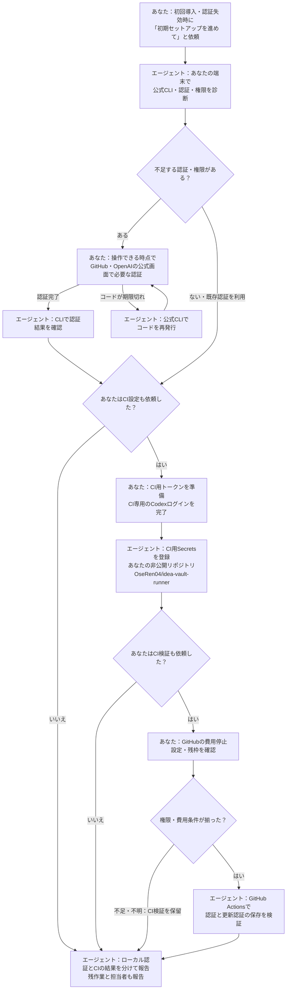

# 初期セットアップの流れ

```mermaid
flowchart TD
  A["あなた：初回導入・認証失効時に<br/>「初期セットアップを進めて」と依頼"] --> B["エージェント：あなたの端末で<br/>公式CLI・認証・権限を診断"] --> C{"不足する認証・権限がある？"}
  C -->|ある| D["あなた：操作できる時点で<br/>GitHub・OpenAIの公式画面で必要な認証"]; D -->|認証完了| E["エージェント：CLIで認証結果を確認"]; E --> F{"あなたはCI設定も依頼した？"}; C -->|ない・既存認証を利用| F; D -->|コードが期限切れ| R["エージェント：公式CLIでコードを再発行"]; R --> D
  F -->|はい| G["あなた：CI用トークンを準備<br/>CI専用のCodexログインを完了"]; G --> H["エージェント：CI用Secretsを登録<br/>あなたの非公開リポジトリ<br/>OseRen04/idea-vault-runner"]; F -->|いいえ| Z["エージェント：ローカル認証とCIの結果を分けて報告<br/>残作業と担当者も報告"]
  H --> I{"あなたはCI検証も依頼した？"}; I -->|いいえ| Z; I -->|はい| J["あなた：GitHubの費用停止設定・残枠を確認"]; J --> K{"権限・費用条件が揃った？"}; K -->|はい| L["エージェント：GitHub Actionsで<br/>認証と更新認証の保存を検証"]; K -->|不足・不明：CI検証を保留| Z; L --> Z
```
[詳しい手順と認証の扱い](SKILL.md)
